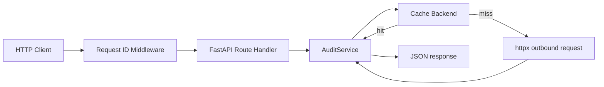

# Architecture

## Executive summary

Page Pulse is a small FastAPI service that accepts a URL, audits it by performing an outbound HTTP request, extracts basic response metadata, and returns a structured JSON payload. The implementation is intentionally simple: one application entry point, one API router, one audit service, one cache abstraction layer, and a request ID middleware.

The current implementation is operational as a single-process service with an in-memory cache fallback and optional Redis support. It is suitable for local development and for a basic deployment environment such as Render.

## System overview

The service exposes two HTTP endpoints:

- GET /health for a basic health response
- POST /audit for URL auditing

The request lifecycle is:

1. A request enters the FastAPI application.
2. The request ID middleware assigns a unique request ID and stores it on the request state.
3. The route handler validates the incoming request body with Pydantic.
4. The audit route checks the request against a simple in-process rate limiter.
5. The audit service checks the cache for a prior result.
6. If no cached value is present, the service performs an outbound HTTP request with httpx.
7. The response is parsed into an audit result model and returned to the client.

## Project goals

The repository currently implements the following goals:

- Provide a simple URL audit API.
- Return structured JSON responses for both success and error cases.
- Support basic caching to reduce repeated work.
- Provide request-level traceability through request IDs.
- Make the service testable through pytest.

## Architecture principles

The current implementation follows a few straightforward principles:

- Keep route handlers thin and delegate work to a service layer.
- Keep request and response contracts explicit with Pydantic models.
- Use environment-based configuration with default values.
- Prefer a simple in-memory cache fallback when Redis is unavailable.
- Make error handling explicit and consistent.

## High-level architecture diagram

## Request lifecycle

### Health request

1. The client sends a GET request to /health.
2. The request ID middleware attaches a request ID to the response.
3. The health route returns a HealthResponse model containing status, timestamp, and version.

### Audit request

1. The client sends a POST request to /audit with a JSON body containing a URL.
2. The request is validated by AuditRequest.
3. The route enforces a simple rate limit based on the client IP and configured rate-limit window.
4. The audit service checks the cache.
5. On a cache miss, the audit service performs an HTTP GET via httpx.
6. The service builds an AuditResult from the response and caches it.
7. The route returns an AuditResponse with request_id, cached, and data.

## Component responsibilities

### FastAPI application

The application entry point is defined in app/main.py. It creates the FastAPI app, registers the request ID middleware, includes the API router, and configures exception handling for request validation and audit errors.

### API routes

The API routing layer is defined in app/api/routes.py. It contains the HTTP handlers for /health and /audit. The route layer is responsible for:

- receiving the request payload,
- applying the current rate limit logic,
- delegating to the audit service,
- formatting the HTTP response.

### Audit service

The service in app/services/audit.py coordinates the audit workflow. It:

- generates a deterministic cache key from the input URL,
- checks the cache,
- executes the outbound HTTP request,
- parses the result into metadata fields,
- writes the result back to the cache.

### Cache backend

The cache abstraction in app/cache/backend.py supports:

- Redis-backed storage when REDIS_URL is configured,
- in-memory storage as a fallback.

The current implementation does not expose a separate distributed cache policy beyond this backend abstraction.

### Middleware

The request ID middleware in app/middleware/request_id.py assigns a UUID to each request and appends the value to the response header X-Request-ID.

### Configuration

Configuration is loaded from environment variables through app/config.py using pydantic-settings. The current settings include cache, timeout, concurrency, rate limit, logging, and environment values.

## Directory structure explanation

The repository is organized by responsibility:

- app/api/: HTTP route handlers
- app/cache/: cache abstraction and implementations
- app/core/: shared constants and error definitions
- app/middleware/: HTTP middleware
- app/schemas/: request and response models
- app/services/: business logic
- app/utils/: logging helpers
- tests/: pytest coverage for the service behavior

This structure is consistent with the implementation and reflects a small layered application rather than a monolithic module.

## Dependency relationships

The current dependency flow is as follows:

- app/main.py depends on app/api/routes.py, app/cache/backend.py, app/config.py, app/core/constants.py, app/core/errors.py, app/middleware/request_id.py, app/services/audit.py, and app/utils/logging.py.
- app/api/routes.py depends on app.config, app.core.errors, app.schemas.request, app.schemas.response, and the audit service attached to the FastAPI app state.
- app/services/audit.py depends on app.core.constants, app.core.errors, and app.schemas.response.
- app/cache/backend.py is used by the audit service through a common backend interface.

## Cache flow

The current cache flow is simple:

1. The audit service creates a deterministic key from the normalized URL string.
2. It calls the cache backend to retrieve data for that key.
3. If the cache returns data, the service returns that cached payload and marks it as cached.
4. If the cache misses, the audit service proceeds to fetch data from the target URL and stores the result using the cache backend.

The cache TTL is configured by the CACHE_TTL setting.

## Error flow

The application uses custom AuditError exceptions to represent operational failures. The route layer passes these errors through the FastAPI exception handling flow and returns a JSON error envelope with a machine-readable code and request_id.

The current implementation maps the following operational cases:

- invalid URL input,
- timeout,
- DNS failure,
- connection refused,
- rate limit exceedance,
- internal HTTP-related failures.

## Logging flow

Logging is configured through app/utils/logging.py using structlog. The application logs:

- startup and shutdown events,
- request receipt,
- audit completion,
- cache hits and misses,
- audit failures.

Request IDs are bound to the logging context so log records include the request_id value.

## Deployment architecture

The current deployment configuration is described by render.yaml and Procfile:

- Render deploys a single web service.
- The service starts with uvicorn.
- The app is served on the port provided by the Render environment.
- The deployment configuration includes environment variable placeholders for Redis, cache TTL, timeout, concurrency, rate limit, and logging.

## Security considerations

The repository currently includes several basic security-related behaviors:

- URL validation only accepts http and https schemes.
- The audit service uses an HTTP client with a User-Agent header.
- The response model includes security header inspection fields.
- Request IDs are included in the error envelope and response headers.

The current implementation does not include authentication, authorization, or a dedicated WAF layer.

## Scalability considerations

The current implementation is single-process and uses an in-memory cache fallback. This means:

- cache state is not shared across multiple service instances,
- the service is simple to run and test,
- concurrency is limited by a semaphore configured through MAX_CONCURRENT_REQUESTS.

The implementation is therefore suitable for a single-instance deployment or small-scale environments rather than a multi-instance distributed architecture.

## Future architecture improvements

The following areas are explicitly not implemented in the current codebase, but would be reasonable future enhancements:

- a dedicated distributed cache layer with shared cache state across instances,
- authentication and authorization layer for the API,
- richer operational metrics and tracing,
- container-based deployment or orchestration,
- a separate worker process for background audit jobs.
